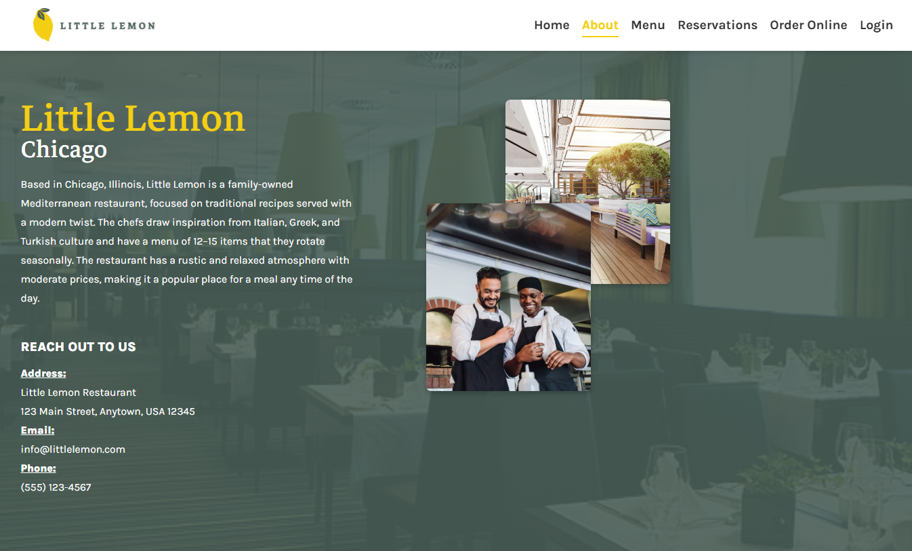

<<<<<<< HEAD

# Little Lemon Restaurant – Meta Front-End Developer Capstone

Welcome to the capstone project for the Meta Front-End Developer Specialization. This repository demonstrates a professional, production-ready React application for the fictional "Little Lemon Restaurant." The project showcases modern front-end development best practices, including responsive design, form validation, state management, and component-driven architecture.

## Live Demo

You can access the deployed version of my Little Lemon website on GitHub pages here:
[https://joelemmanuel795.github.io/Meta_Capstone_Project/](https://joelemmanuel795.github.io/Meta_Capstone_Project/)

<p align="center">
  
</p>

## Table of Contents

- [Project Overview](#project-overview)
- [Screenshots](#screenshots)
- [Features](#features)
- [Tech Stack](#tech-stack)
- [Getting Started](#getting-started)
- [Project Structure](#project-structure)
- [Key Learnings](#key-learnings)
- [License](#license)

---

## Project Overview

This project was built as the capstone for the Meta Front-End Developer Certification. It includes:

- A fully responsive homepage and booking page for "Little Lemon Restaurant"
- Clean, maintainable code following a consistent style guide
- Real-world UI/UX patterns and accessibility considerations

## Screenshots

**Responsive design allows all components to be comfortably viewed across desktop and mobile devices**

<p align="center">
  
  
  
</p>

---

<p align="center">
  
  
  
</p>

## Features

- **Responsive Design:** Mobile-first layouts using CSS modules and best practices
- **Form Validation:** Robust booking form with client-side validation and user feedback
- **State Management:** Efficient use of React state and props for dynamic UI updates
- **Component Architecture:** Modular, reusable React components for scalability
- **Virtual DOM Efficiency:** Optimized rendering for fast, smooth user experience
- **Adherence to Style Guide:** Consistent design language and branding throughout

## Tech Stack

- **React** (JSX, Virtual DOM)
- **JavaScript** (ES6+)
- **HTML5 & CSS3**
- **Jest** (unit testing)
- **Create React App** (project scaffolding)

## Getting Started

1. **Clone the repository:**
   ```powershell
   git clone <repo-url>
   cd my-app
   ```
2. **Install dependencies:**
   ```powershell
   npm install
   ```
3. **Start the development server:**
   ```powershell
   npm start
   ```
4. **Run tests:**
   ```powershell
   npm test
   ```

## Project Structure

```
my-app/
├── public/                # Static assets
├── src/                   # Source code
│   ├── Components/        # React components
│   ├── Content/           # Images and media
│   ├── CSS/               # Stylesheets
│   ├── App.js             # Main app component
│   ├── index.js           # Entry point
│   └── ...
├── package.json           # Project metadata
├── README.md              # Project documentation
└── ...
```

## Key Learnings

- Building scalable React applications with reusable components
- Implementing responsive layouts for all device sizes
- Managing state and props for dynamic user interfaces
- Validating forms and providing real-time feedback
- Following a style guide for professional UI consistency
- Writing unit tests for reliability

---

**Developed as part of the Meta Front-End Developer Specialization.**

## Available Scripts

In the project directory, you can run:

### `npm start`

Runs the app in the development mode.\
Open [http://localhost:3000](http://localhost:3000) to view it in your browser.

The page will reload when you make changes.\
You may also see any lint errors in the console.

### `npm test`

Launches the test runner in the interactive watch mode.\
See the section about [running tests](https://facebook.github.io/create-react-app/docs/running-tests) for more information.

### `npm run build`

Builds the app for production to the `build` folder.\
It correctly bundles React in production mode and optimizes the build for the best performance.

The build is minified and the filenames include the hashes.\
Your app is ready to be deployed!

See the section about [deployment](https://facebook.github.io/create-react-app/docs/deployment) for more information.

### `npm run eject`

**Note: this is a one-way operation. Once you `eject`, you can't go back!**

If you aren't satisfied with the build tool and configuration choices, you can `eject` at any time. This command will remove the single build dependency from your project.

Instead, it will copy all the configuration files and the transitive dependencies (webpack, Babel, ESLint, etc) right into your project so you have full control over them. All of the commands except `eject` will still work, but they will point to the copied scripts so you can tweak them. At this point you're on your own.

You don't have to ever use `eject`. The curated feature set is suitable for small and middle deployments, and you shouldn't feel obligated to use this feature. However we understand that this tool wouldn't be useful if you couldn't customize it when you are ready for it.
